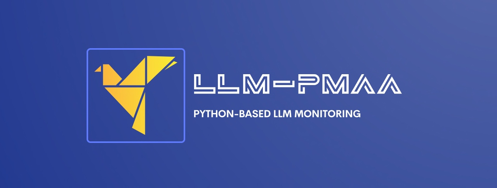

# Building the locally optimized Python-based LLM Performance Monitoring AI App (LLM-PMAA)



## About this package

This new solution will evaluate the performance of some of the mature, newbie LLMs, which will help to capture some of the most important questions of Gen AI engineers. This post opens new opportunities for IT companies & business start-ups looking to deliver solutions & have better performance compared to multiple models available all across the world. For this project, the team has identified the following LLMs: Open AI, Anthropic, DeepSeek & Bharat GPT (Local LLMs). This project is for the advanced Python, Stable Defussion for data Science Newbies & AI evangelists.


## How to use this package

(The following instructions apply to Posix/bash. Windows users should check [here](https://docs.python.org/3/library/venv.html).)

First, clone this repository and open a terminal inside the root folder.

Install the requirements:

```bash
pip install -r requirements.txt
```

Install the above requirements.

Create and activate a new virtual environment (recommended) for consumer applications by running the following:

```bash
python3.13 -m venv env
source env/bin/activate
```

Run the server, which will interact with Stable Defussion AI API & then run the custom python-based Stable Defussion python-based SDK application.

Built-In LLM Monitoring Application: 

```bash
python generateLLMPerformance.py
```

Please find some of the essential dependent packages -

```
pip install certifi==2024.8.30
pip install anthropic==0.42.0
pip install huggingface-hub==0.27.0
pip install nltk==3.9.1
pip install numpy==2.2.1
pip install moviepy==2.1.1
pip install numpy==2.1.3
pip install openai==1.59.3
pip install pandas==2.2.3
pip install pillow==11.1.0
pip install pip==24.3.1
pip install psutil==6.1.1
pip install requests==2.32.3
pip install rouge_score==0.1.2
pip install scikit-learn==1.6.0
pip install setuptools==70.2.0
pip install tokenizers==0.21.0
pip install torch==2.6.0.dev20250104
pip install torchaudio==2.6.0.dev20250104
pip install torchvision==0.22.0.dev20250104
pip install tqdm==4.67.1
pip install transformers==4.47.1

```

## Screenshots


## Resources

- To view the complete demo with sound, check out our [YouTube Page](https://youtu.be/jMERwsokd6Q).
- To view Python, check out the [Python Page](https://docs.python.org/3/).
- To view Anthropic, check out the [Anthropic Page](https://docs.anthropic.com/en/docs/welcome).
- To view Open AI, check out the [OpenAI Page](https://huggingface.co/stabilityai/stable-diffusion-3.5-large).
- To view Bharat GPT, check out the [Bharat GPT Page](https://huggingface.co/CoRover/BharatGPT-3B-Indic).
- To view DeepSeek, check out the [DeepSeek Page](https://api-docs.deepseek.com/api/deepseek-api).
